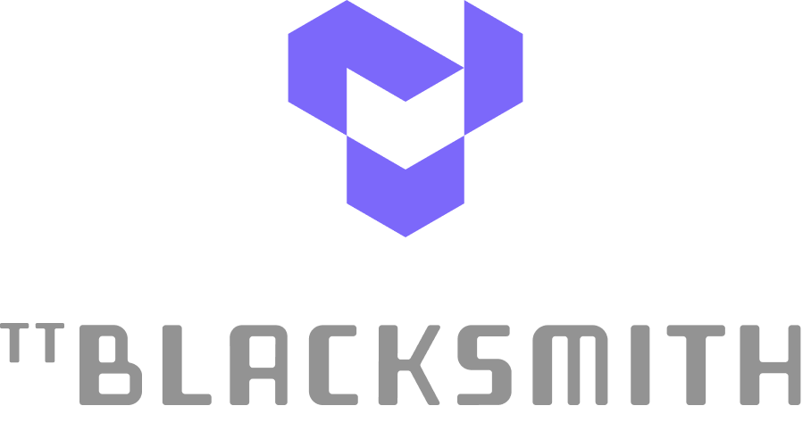

[](https://deepwiki.com/tenstorrent/tt-blacksmith)

<div align="center">

<h1>

 [Hardware](https://tenstorrent.com/cards/) | [Documentation](https://docs.tenstorrent.com/tt-blacksmith/) | [Discord](https://discord.gg/tenstorrent) | [Join Us](https://job-boards.greenhouse.io/tenstorrent?gh_src=22e462047us) | [Bounty $](https://github.com/tenstorrent/tt-blacksmith/issues?q=is%3Aissue%20state%3Aopen%20label%3Abounty)

</h1>
<picture>
  
</picture>

</div>
<br>

-----
# TT-Blacksmith

**TT-Blacksmith** contains optimized training recipes for machine learning models on [Tenstorrent](https://tenstorrent.com/) hardware, powered by the [TT-Forge](https://github.com/tenstorrent/tt-forge) compiler stack. It enables training with popular frameworks like PyTorch, JAX, and PyTorch Lightning — showcasing the compiler's flexibility across vision models, LLMs, and NLP tasks.

> **Part of the [TT-Forge](https://github.com/tenstorrent/tt-forge) AI compiler ecosystem.**

-----
# Quick Links

- [Getting Started](https://docs.tenstorrent.com/tt-blacksmith/src/getting-started.html)
- [Experiments](https://docs.tenstorrent.com/tt-blacksmith/src/experiments.html) — 40+ training recipes across PyTorch, JAX, and Lightning

-----
# What is this Repo?

A collection of ready-to-run training experiments that show developers how to train ML models on Tenstorrent hardware. Models span MNIST, ResNet, ViT, Llama (LoRA/Adapters), Gemma, Qwen, Phi, ALBERT, DistilBERT, NeRF, and more.

```bash
git clone https://github.com/tenstorrent/tt-blacksmith.git && cd tt-blacksmith
source env/activate --xla
# Run an experiment (e.g., MNIST with PyTorch on TT-XLA)
pytest blacksmith/experiments/torch/mnist/xla/test_mnist_mlp_training.py -svv
```

-----
# Project Goals

- **Practical demonstrations** — End-to-end training workflows for vision, NLP, and generative models on Tenstorrent hardware
- **Framework coverage** — Examples using PyTorch (via TT-XLA), JAX, and PyTorch Lightning
- **Community contributions** — Tagged bounty issues for community contributors

-----
# Related Tenstorrent Projects
- [TT-Forge](https://github.com/tenstorrent/tt-forge) — Central hub for the TT-Forge compiler project (demos, benchmarks, releases)
- [TT-XLA](https://github.com/tenstorrent/tt-xla) — Primary frontend for PyTorch and JAX (single and multi-chip)
- [TT-Forge-ONNX](https://github.com/tenstorrent/tt-forge-onnx) — Frontend for ONNX, TensorFlow, and PaddlePaddle (single-chip)
- [TT-MLIR](https://github.com/tenstorrent/tt-mlir) — Core MLIR-based compiler framework for Tenstorrent hardware
- [TT-Metalium](https://github.com/tenstorrent/tt-metal) — Low-level programming model and kernel development

-----
# Tenstorrent Bounty Program Terms and Conditions
This repo is a part of Tenstorrent’s bounty program. If you are interested in helping to improve tt-forge, please make sure to read the [Tenstorrent Bounty Program Terms and Conditions](https://docs.tenstorrent.com/bounty_terms.html) before heading to the issues tab. Look for the issues that are tagged with both “bounty” and difficulty level!

[deepwiki]: https://deepwiki.com/tenstorrent/tt-blacksmith
[deepwiki badge]: https:deepwiki.com/badge.svg
