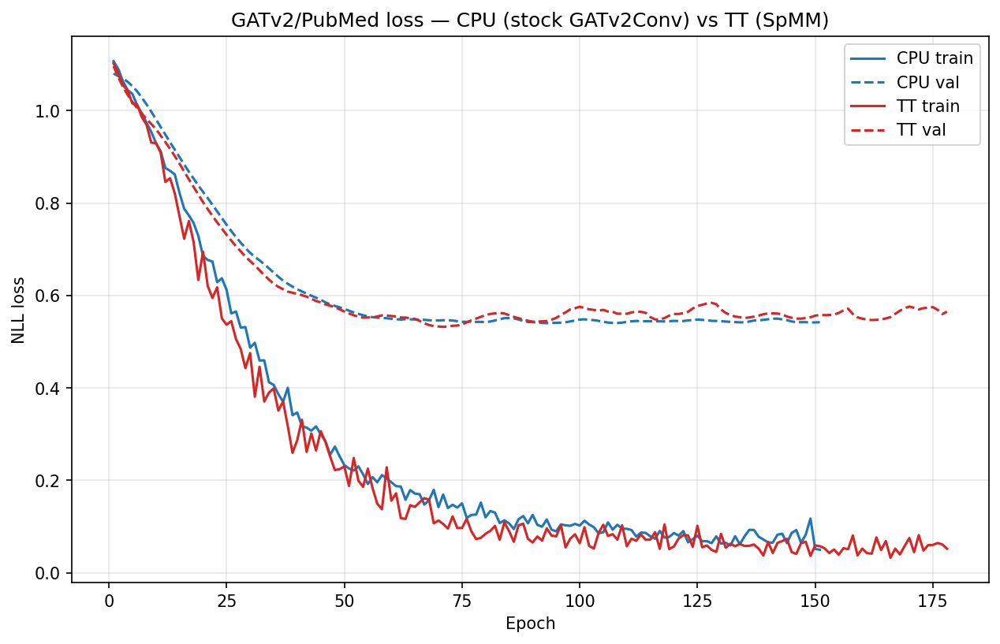
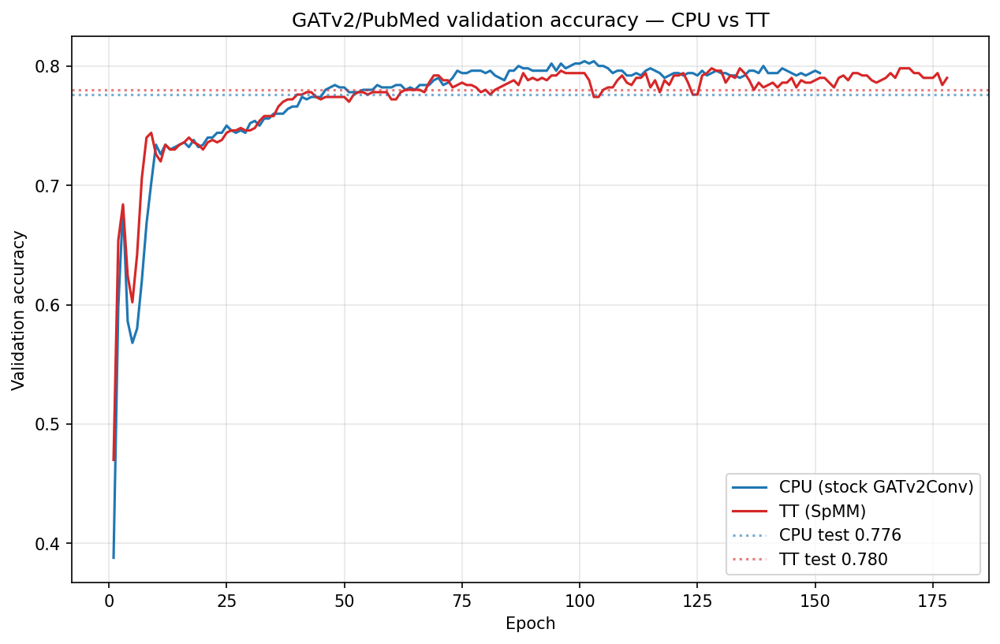

# GATv2 / PubMed — CPU vs TT results

Full transductive training on PubMed (19,717 nodes, 88,648 edges; 108,365 with
self-loops), seed 42, identical hyperparameters. CPU runs the stock
`GATv2Conv` (scatter); TT runs `SpMMGATv2Conv` (matmul, `use_spmm: true`) on a
Wormhole b0 N300. The SpMM layer is bit-equivalent to `GATv2Conv` on CPU
(loss identical, per-parameter gradient cosine 1.0), so this is a like-for-like
comparison of the same model on the two backends.

## Accuracy parity

| Metric | CPU (stock GATv2Conv) | TT (SpMM) |
|---|---|---|
| Device | cpu | Wormhole b0 N300 (`xla:0`) |
| Convolution | `GATv2Conv` (scatter) | `SpMMGATv2Conv` (matmul) |
| **Test accuracy** | **0.7760** | **0.7800** |
| Best val accuracy | 0.8040 | 0.7980 |
| Test loss | 0.5773 | 0.5963 |
| Final train loss | 0.0499 | 0.0522 |
| Epochs (early stop, patience 50) | 151 | 178 |

Test-accuracy gap (TT − CPU): **+0.0040** — within run-to-run noise; TT matches
the CPU baseline.

## Curves

Training/validation loss and validation accuracy track each other closely
throughout training:




## Execution on TT

| Property | Value |
|---|---|
| `ttnn.scatter` ops in the training-step graph | **0** (the tt-mlir#8714 tiling blowup is fully bypassed) |
| `ttnn.matmul` ops | 168 |
| Step time after compile | ~1.9 s/step |
| Peak DRAM | fits a single 12 GB chip (bf16 one-hot) |
| TTIR proof graph | `module @SyncTensorsGraph` / `func.func @main`, emitted under `TTXLA_LOGGER_LEVEL=DEBUG` |

The model runs **entirely on device** — there is no CPU fallback. See
[`spmm_gatv2.py`](spmm_gatv2.py) for the SpMM reformulation and the README's
"TT Execution Status" section for the design rationale.

## Reproduce

```bash
source env/activate --xla

# CPU baseline (stock GATv2Conv)
PYTHONPATH=. python blacksmith/experiments/torch/BOUNTIES/gatv2_pubmed/test_gatv2_pubmed_training.py \
    --config blacksmith/experiments/torch/BOUNTIES/gatv2_pubmed/test_gatv2_pubmed_training.yaml

# TT (SpMM)
PYTHONPATH=. python blacksmith/experiments/torch/BOUNTIES/gatv2_pubmed/test_gatv2_pubmed_training.py \
    --config blacksmith/experiments/torch/BOUNTIES/gatv2_pubmed/test_gatv2_pubmed_training_tt.yaml
```

Each run writes `results/results_summary.json` (final metrics + per-epoch
`metrics_history`) and per-run loss/accuracy plots.
