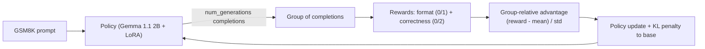

# Gemma 1.1 2B GRPO Experiment

This directory contains the code for the Gemma 1.1 2B reasoning experiment using
GRPO (Group Relative Policy Optimization). It reproduces, in the tt-blacksmith
experiment structure, the toy example from Luca Massaron's blog series.

- Gemma 1.1 2B model specification can be found [here](https://huggingface.co/google/gemma-1.1-2b-it).
- GRPO is introduced in "DeepSeekMath: Pushing the Limits of Mathematical Reasoning in Open Language Models" ([paper](https://arxiv.org/pdf/2402.03300)).
- Blog references:
  [part I](https://medium.com/@lucamassaron/training-for-reasoning-with-grpo-881e1819f2df),
  [part II](https://medium.com/@lucamassaron/training-for-reasoning-with-grpo-part-ii-a-step-by-step-explanation-f80c219e2059).

> **CPU-first bring-up.** vLLM is disabled and the model is loaded in `float32`.
> GRPO of a 2B model on CPU is very slow and memory hungry, so the default config
> is a **lightweight smoke test** to validate the pipeline, not a real training
> run. For actual training use GPU/TT (and ideally vLLM).

## Overview

GRPO is a reinforcement-learning method that teaches a model to reason without a
learned reward model and without a value/critic network. Instead, for each prompt
the model samples a **group** of completions, scores each one with simple,
rule-based reward functions, and shifts probability mass towards the completions
that scored better *than the group average* (the "group-relative advantage").

The heavy RL loop (generation, grouping, advantage estimation, policy update) is
delegated to TRL's `GRPOTrainer`. This experiment supplies the model, dataset,
reward functions, and configuration, wrapped in the same
config/CLI/logging scaffolding used by the other tt-blacksmith experiments.

## How GRPO training works

For every training step:

1. **Sampling.** For each prompt in the batch, the policy model generates
   `num_generations` completions with `temperature > 0` (so the group is diverse).
2. **Reward scoring.** Each completion is scored by the reward functions in
   [`grpo_rewards.py`](grpo_rewards.py):
   - `format_reward_func` -> `1.0` if the completion matches
     `<reasoning>...</reasoning><answer>...</answer>`, else `0.0`.
   - `correctness_reward_func` -> `2.0` if the extracted answer equals the GSM8K
     ground truth, else `0.0`.
   The two are summed, so each completion gets a reward in `[0.0, 3.0]`.
3. **Grouping.** The mean and standard deviation of the rewards are computed over
   the group of completions for the same prompt.
4. **Advantage calculation.** Each completion's reward is normalized within its
   group: `advantage = (reward - group_mean) / (group_std + eps)`. Completions
   above the group average get a positive advantage, those below get a negative one.
5. **Policy optimization.** The policy is updated to increase the log-probability
   of tokens in high-advantage completions and decrease it for low-advantage ones,
   while a KL-divergence penalty (`grpo_beta`) keeps the policy close to the frozen
   base model so it does not drift or collapse.

Because the reward is *relative to the group*, no critic network or absolute
reward scale is needed: a rising average reward over training means the model is
producing correctly formatted, correct answers more consistently.



### Model and adapter

A **fresh LoRA adapter** is attached to the base instruction-tuned model
(`google/gemma-1.1-2b-it`) and trained by GRPO. There is **no SFT stage**: the
frozen base model itself serves as the reference policy for the KL term. Following
the blog, `lora_r == lora_alpha` (so the effective LoRA scaling is `1.0`) and all
seven projection matrices are targeted. After training, the adapter is merged back
into the base weights (`merge_and_unload`) and saved to `final_model/`.

## Training

The dataset and hyperparameters are selected through the configuration file passed
via `--config`. If no config is provided,
`single_chip/gemma11_gsm8k_grpo.yaml` is used by default.

### CPU smoke test

```bash
python3 blacksmith/experiments/torch/gemma11/grpo/train.py --config blacksmith/experiments/torch/gemma11/grpo/single_chip/gemma11_gsm8k_grpo.yaml
```

The default config runs only a couple of steps with tiny `num_generations`,
`max_completion_length`, and (for safety) a capped `cpu_num_threads` so it cannot
take the whole machine down. Generation on CPU is still slow; expect a few minutes
per step. To do real training, move to accelerated hardware and scale the values up
(see the warning above).

#### Training Configuration

| Architecture | Device | dataset | Method |
| ------------ | ------ | ------- | ------ |
| [CPU](single_chip/gemma11_gsm8k_grpo.yaml) | CPU (float32, smoke test) | GSM8K | GRPO + LoRA |

## Data

### GSM8K

GSM8K is a dataset of grade-school math word problems. Each example has a
`question` and an `answer` whose final numeric value follows a `####` delimiter.
The loader ([`gsm8k_dataset.py`](../../../../datasets/torch/gsm8k/gsm8k_dataset.py))
converts each example into TRL's prompt-completion format:

```python
{
  "prompt": [{"role": "user", "content": "<R1-style instructions>\n\n<question>"}],
  "answer": "72",  # ground-truth integer parsed from the '#### 72' suffix
}
```

The `answer` column is not used by the trainer directly; TRL forwards it to the
reward functions so correctness can be checked.

Source: [Hugging Face Dataset Hub](https://huggingface.co/datasets/openai/gsm8k)

Example:
```
{
  "question": "Natalia sold clips to 48 of her friends in April, and then she sold half as many clips in May. How many clips did Natalia sell altogether in April and May?",
  "answer": "Natalia sold 48/2 = 24 clips in May. Natalia sold 48+24 = 72 clips altogether in April and May. #### 72"
}
```

## Configuration

The experiment is configured using `single_chip/gemma11_gsm8k_grpo.yaml`, validated
into [`GRPOTrainingConfig`](configs.py).

### Configuration Parameters

| Parameter | Description | Default Value |
| --- | --- | --- |
| `training_model_type` | Fine-tuning approach for the policy model (`lora` or full fine-tuning). | "lora" |
| `dataset_id` | The dataset used for training. | "gsm8k" |
| `model_name` | Name or path of the base Gemma 1.1 2B model. | "google/gemma-1.1-2b-it" |
| `dtype` | Data type used to load the model (float32 for CPU). | "torch.float32" |
| `grpo_beta` | KL coefficient towards the frozen base policy. | 0.005 |
| `num_generations` | Completions sampled per prompt (group size). | 2 |
| `temperature` | Sampling temperature for generation. | 0.5 |
| `max_completion_length` | Maximum generated completion length. | 32 |
| `use_vllm` | Use vLLM for generation (GPU only; keep False on CPU). | False |
| `learning_rate` | Learning rate for the optimizer. | 1e-5 |
| `batch_size` | `per_device_train_batch_size`; must be a multiple of `num_generations`. | 2 |
| `gradient_accumulation_steps` | Steps to accumulate gradients before updating. | 1 |
| `gradient_checkpointing` | Trade compute for lower activation memory. | True |
| `weight_decay` | Weight decay for the optimizer. | 0.1 |
| `num_epochs` | Total number of training epochs. | 1 |
| `max_steps` | Maximum number of optimizer steps (-1 means use `num_epochs`). | 2 |
| `optim` | Optimizer to use for training. | "adamw_torch" |
| `adam_beta1` / `adam_beta2` | Adam beta parameters. | 0.9 / 0.99 |
| `warmup_ratio` | Fraction of steps used for LR warmup. | 0.1 |
| `max_grad_norm` | Gradient clipping value. | 0.1 |
| `lr_scheduler_type` | Learning-rate schedule. | "cosine" |
| `cpu_num_threads` | Cap on PyTorch intra-op threads (CPU guardrail; null = default). | 16 |
| `log_level` | Logging verbosity level. | "INFO" |
| `use_wandb` | Whether to enable Weights & Biases logging (via TRL). | False |
| `wandb_project` | Project name for Weights & Biases logging. | "gemma11-grpo" |
| `wandb_run_name` | Run name for Weights & Biases tracking. | "gemma11-grpo-gsm8k" |
| `wandb_tags` | List of tags assigned to the W&B run. | ["gemma11", "grpo", "gsm8k", "lora"] |
| `logging_steps` | Frequency (in steps) of metric logging. | 1 |
| `save_steps` | Frequency (in steps) for saving checkpoints. | 1000 |
| `keep_last_n` | Number of recent checkpoints to keep (`save_total_limit`). | 3 |
| `project_dir` | Directory for experiment outputs. | "blacksmith/experiments/torch/gemma11/grpo" |
| `seed` | Random seed for reproducibility. | 23 |
| `deterministic` | Whether to enforce deterministic behavior. | False |
| `lora_r` | Rank of LoRA adaptation matrices. | 64 |
| `lora_alpha` | Scaling factor for LoRA updates. | 64 |
| `lora_dropout` | Dropout probability for LoRA layers. | 0.0 |
| `lora_task_type` | Training task type for LoRA. | "CAUSAL_LM" |
| `lora_target_modules` | Target modules for LoRA adaptation. | q/k/v/o/gate/up/down_proj |
| `framework` | Training framework. | "pytorch" |
| `use_tt` | Whether to run on TT device (CPU-first, so False). | False |

## Outputs

- `outputs/` - TRL trainer checkpoints and logs (`output_dir`).
- `final_model/` - the LoRA adapter merged into the base model, plus the tokenizer.
